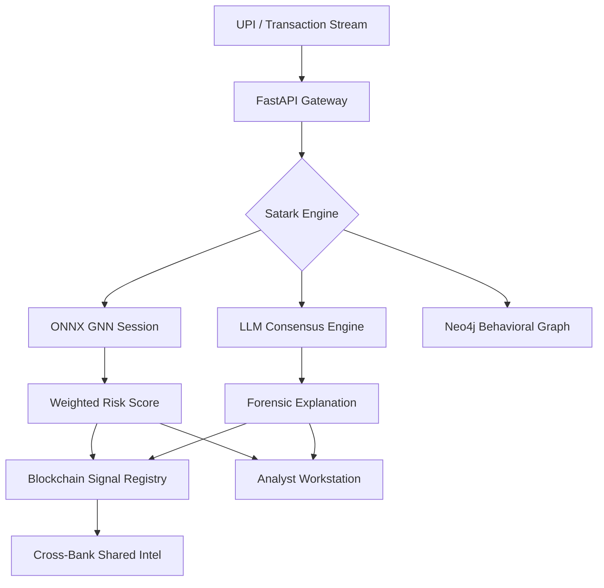

# सतर्क AI — SatarkAI
### *हर लेन-देन पर नज़र*
**An eye on every transaction**

<br/>

[](https://python.org)
[](https://fastapi.tiangolo.com)
[](https://reactjs.org)
[](https://pyg.org)
[]()
[](LICENSE)

<br/>

> **SatarkAI is a high-performance, graph-intelligent fraud detection engine** designed for UPI-scale real-time monitoring. 
> By combining **Graph Attention Networks (GAT)** with an immutable **Blockchain Federated Layer** and a **4-LLM Consensus Engine**, SatarkAI provides institutional-grade precision with human-readable forensic explanations.

<br/>

## 🚀 Core Pillars

### 1. High-Performance GNN Engine (Phase 2)
Traditional ML misses relational patterns. SatarkAI uses a **Graph Attention Network (GAT)** built with PyTorch Geometric to analyze the 2-hop neighborhood of every transaction.
- **Sub-50ms Inference**: Models are exported to **ONNX** for ultra-fast production execution.
- **Advanced Graph Topology**: Interconnects Users, Devices, IPs, and Merchants to detect fraud rings and mule clusters.
- **Real-Data Training**: Pre-integrated with the **IEEE-CIS** fraud dataset for state-of-the-art accuracy.

### 2. Blockchain Federated Layer (Phase 3)
A decentralized trust layer built on **Polygon (Amoy Testnet)** that enables cross-institutional collaboration without sharing raw PII.
- **FraudSignalRegistry**: A smart contract that stores immutable "risk fingerprints" (Hashed Device/IP signals) shared across the bank network.
- **FraudAuditLedger**: Provides a cryptographically verifiable audit trail of every high-risk decision.
- **Federated Learning**: (In-Progress) Secure model updates using **Flower (flwr)** to learn from cross-bank fraud patterns.

### 3. Production-Grade Analyst Workstation (Phase 6)
A premium, **Glassmorphic Dashboard** designed for mission-critical fraud investigation.
- **Forensic Console**: Side-by-side comparison of GNN relational signals vs. LLM consensus reasoning.
- **Luminous Entity Mapper**: High-performance D3.js visualization of the transaction fabric.
- **Multi-Model Consensus**: Real-time insights from Claude 3.5, Gemini 1.5 Pro, and Llama 3 for definitive explainability.

---

## 🏗️ Architecture



---

## 🛠️ Tech Stack

| Layer | Technology | Status |
|---|---|---|
| **Core API** | FastAPI + Python 3.11 | ✅ Production |
| **GNN Framework** | PyTorch Geometric (GAT) | ✅ Production |
| **Inference Engine** | ONNX Runtime | ✅ Optimized |
| **Graph DB** | Neo4j + In-Memory Fallback | ✅ Production |
| **Blockchain** | Solidity + Hardhat + Web3.py | ✅ Polygon Amoy |
| **ML Ops** | MLflow + Redis | ✅ Integrated |
| **Frontend** | React + Vite + Tailwind CSS | ✅ Redesigned |
| **Visuals** | D3.js + Luminous SVG | ✅ Pro-Grade |

---

## 🚦 Quickstart (Local Development)

### Prerequisites
- Node.js 22+ (LTS)
- Python 3.11+
- Docker Desktop

### 1. Environment Configuration
```bash
cp .env.example .env
# Fill in your AI keys and local contract addresses
```

### 2. Start Application Stack
```bash
docker compose up --build
```

### 3. Initialize Blockchain (Optional)
```bash
# In Root
npm install
npx hardhat node
npx hardhat run scripts/deploy.js --network localhost
```

### 4. Access Dashboard
- **HUD**: [http://localhost:5173](http://localhost:5173)
- **API Docs**: [http://localhost:8000/docs](http://localhost:8000/docs)

---

## 📈 Roadmap

- [x] Phase 1: MVP & 4-LLM Reasoning Engine
- [x] Phase 2: GNN & Sub-50ms ONNX Infrastructure
- [x] Phase 3: Blockchain Cross-Bank Registry
- [x] Phase 6: Pro-Grade UI Redesign
- [ ] Phase 4: UPI Webhook / NPCI Sandbox Integration
- [ ] Phase 5: RBI Compliance One-Click Reporting

---

## 🤝 Contributing
SatarkAI is an open-source movement for a safer financial Bharat. 
1. Fork the Project
2. Create your Feature Branch (`git checkout -b feature/AmazingFeature`)
3. Commit your Changes (`git commit -m 'Add some AmazingFeature'`)
4. Push to the Branch (`git push origin feature/AmazingFeature`)
5. Open a Pull Request

---

<div align="center">

**सतर्क रहो। सुरक्षित रहो।**
*Stay vigilant. Stay safe.*

Made with care for Bharat 🇮🇳

</div>
